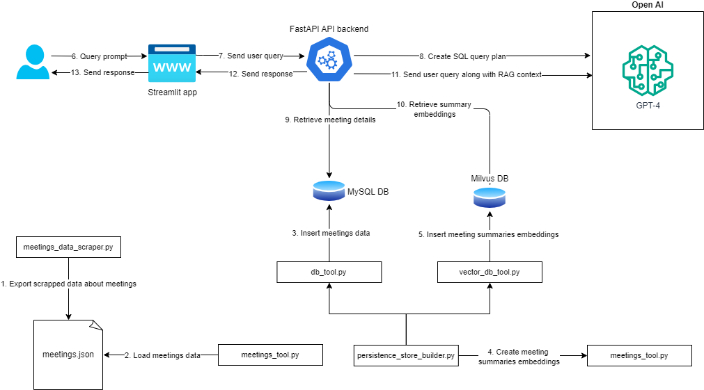

## 1. The project

This project contains code for processing publicly available data about debates in the Canadian Parliament and 
creating simplified summaries and insights based on user queries.

## 2. Project structure

├── README.md                       
├── api_requirements.txt            
├── storage                         
├── data             
│   ├── data.sql                 
│   ├── meetings.json                      
│   └── vector_embeddings.json                             
├── docker-compose.yml    
├── Dockerfile.api     
├── Dockerfile.frontend  
├── Dockerfile.datascraper   
├── Dockerfile.persistencestorebuilder
├── data_scrapper_requirements.txt
├── persistencestorebuilder_requirements.txt
├── frontend_requirements.txt    
├── ml_models    
├── output    
├── requirements.txt   
└── src   
    ├── backend  
    │   ├── api.py                  
    │   └── main.py                 
    ├── frontend                    
    │   └── main.py                 
    ├── consts.py   
    ├── meetings_data_scraper.py  
    ├── ml   
    │   ├── bert_meetings_summarization.py  
    │   ├── evaluate_summarization_models.py  
    │   ├── langchain_mistral_meetings_summarization.py  
    │   ├── mistral_meeting_summarization.py  
    │   └── transformers_meeting_summarization.py  
    ├── test.py   
    └── tools   
        ├── db_tools.py   
        ├── meetings_tools.py   
        ├── persistence_store_builder.py  
        ├── prompt_tool.py  
        ├── prompt_tool_using_llmware.py  
        ├── summarization_tools.py  
        └── vector_db_tool.py  

## 3. Files and folders description 

- **api_requirements.txt**                     - list of required Python packages for running the backend api service
- **storage**                                  - docker containers volumes folders
- **data**                                     - data folder
- **data/data.sql**                            - MySQL scheme along with data
- **data/meetings.json**                       - data about held meetings as of 06/20/2024 
- **data/vector_embeddings.json**              - generated vector embeddings using the facebook/bart-large-cnn model model for meetings summaries stored in the data/meetings.json file
- **docker-compose.yml**                       - Docker services required for running the application
- **Dockerfile.api**                           - Docker container definition for the API service
- **Dockerfile.frontend**                      - Docker container definition for the frontend service
- **Dockerfile.datascraper**                   - Docker container definition for the data scraping tool
- **Dockerfile.persistencestorebuilder**       - Docker container definition for the persistence builder tool
- **frontend_requirements.txt**                - list of required Python packages for running the frontend service
- **data_scrapper_requirements.txt**           - list of dependency packages for running the data scraping tool
- **persistencestorebuilder_requirements.txt** - list of dependency packages for running the persistence store builder tool
- **ml_models**                                - location of ML models used for ad-hoc code testing
- **output**                                   - location where log files and other output files are stored
- **requirements.txt**                         - list of required Python packages for running modules in the project separately from the main application
- **src**                                      - the source code folder
- **src/backend**                              - code related to the backend service
- **src/backend/api.py**                       - backend service API routes
- **src/backend/main.py**                      - API service initialization code such as downloading necessary ML models
 - **src/frontend**                            - frontend service code
 - **src/frontend/main.py**                    - the main file containing the frontend service code   

## 4. Architecture diagram


*Architecture*

## 5. Prerequisities

All Python packages, required by the application to run, are specified in the requirements.txt file.

## 6. The .env files and environment variables

Sensitive information such as API keys and database credentials are stored in .env files.
These files are not commited to the repository and need to be created before running the app.
There are two .env files used, **.env.dev** and **.env.docker.dev**.
The **.env.dev** files is used when the app is run directly on a host machine while the **.env.docker.dev**
files is used when app is run inside Docker containers.

An example of **.env.dev** file:

```
DB_HOST=localhost
DB_PORT=13306
DB_USER=root
DB_PASSWORD=P@ssw0rd
DB_DATABASE_NAME=test
MILVUS_HOST=localhost
MILVUS_PORT=19530
MILVUS_DATABASE_NAME=default
MILVUS_MEETING_SUMMARIES=meeting_summaries
OPENAI_API_KEY=<API_KEY_VALUE>
```

An example of **.env.docker.dev** file:

```
DB_HOST=mariadb
DB_PORT=3306
DB_USER=root
DB_PASSWORD=P@ssw0rd
DB_DATABASE_NAME=test
MILVUS_HOST=milvus-standalone
MILVUS_PORT=19530
MILVUS_DATABASE_NAME=default
MILVUS_MEETING_SUMMARIES=meeting_summaries
OPENAI_API_KEY=<API_KEY_VALUE>
```

## 7. Vector database

Milvus was choosen as a vector database as it has the highest GitHub Star rating and strong community support. 
The default vector database has a single collection called "meeting_summaries".
In that collection are stored embedding vectors and ID values corresponding to ID
values of original summary content stored in a relational database table.

## 8. Relational database

MySQL is used as a relational database management system. It is used for storing structured data such as information about meetings, subjects and meeting summaries.

## 9. Meetings data scraping

Data about meetings is scraped using the **meetings_data_scraper.py** script.
The script can be run either directly using the command:
```Python
python meeting_data_scraper.py
```
or using the Docker container:
```bash
docker build -t data-scraper:latest -f Dockerfile.datascraper .
docker run -v ./deployment/volumes/data-scraper:/data:rw --name data-scraper data-scraper:latest
```
> Both commands should be run from the project's root folder. When running the data scraping directly by invoking the **meeting_data_scraper.py** script, the script prerequisities need to be installed via the command: **pip3 install -r data_scrapper_requirements.txt**

## 10. Generating summaries vector embeddings

Vector embeddings for meeting summaries are created and stored in the MySQL database after creating tables and collections in the MySQL and Milvus.
By default the **facebook/bart-large-cnn model** is used to created vector embeddings for meeting summaries.
The process of creating the vector embeddings can take some time because the summaries are generated using the conversation recordings for 
each meeting.
Total number of input tokens for the **facebook/bart-large-cnn model** vector embedding model is **294859456** tokens.
That number refers to the content of recorded conversation for the meetings held between 12/16/2021 and 06/20/2024.

> The prerequisite for generating summaries and vector embeddings is to run data scraping first which exports data about meetings into a .json file.

## 11. Services

There are 7 different Docker services used in the example:
- **milvus-etcd** - Milvus metadata storage and access
- **milvus-minio** - Milvus storage engine for data persistence of insert log files and index files
- **milvus-standalone** - Milvus vector database used for storing meeting summaries embeddings
- **mariadb** - MariaDB server used for storing non-vectorized data such as meeting subjects, meeting numbers, speakers etc.
- **attu** - management service for Milvus
- **api-backend** - backend API service
- **frontend** - frontend service

All services are defined in the **docker-compose.yml** file.
To spin up services, run the following command from within the project root directory:
```bash
DOCKER_VOLUME_DIRECTORY=PATH_TO_THE_VOLUMES_DIRECTORY docker-compose up -d 
```
> If not set, the value for the DOCKER_VOLUME_DIRECTORY variable will be **./deployment/volumes**

## 12. Initalizing the persistence store

The persistence store could be built either by running the **persistence_store_builder.py** script directly or by using the Docker container.

### 12.1. Running the persistence store builder script directly
The Milvus and the MySQL database can be initalized 
by running either the **load_saved_data** or the 
**build_meetings_persistence_store** function in the **persistence_store_builder.py** module.
Both functions will initalize empty 
Milvus and MySQL databases, the only difference is that the **load_saved_data** function will load exported vector embeddings and SQL scheme, along with data, from files while the **build_meetings_persistence_store** function will populate the MySQL and Milvus databases using the provided list with meetings data and generate vector embeddings for each meeting summary. 

> Loading existing data requires that the **Id** column, in the Milvus's **meeting_summaries** collection, is created without auto increment feature enabled. This is handled in the **load_saved_data** function.

### 12.2. Using Docker container

To build persistence store using Docker container comment/uncomment the required code lines in the **persistence_store_builder.py** script and build the Docker image by executing the command from the project root folder:

```
docker build -t persistence-store-builder:latest -f Dockerfile.persistencestorebuilder .
```

After the Docker image is built, the Docker container can be run using the command:

```
docker run --network canpolicy_insight --name persistence-store-builder persistence-store-builder:latest
```
